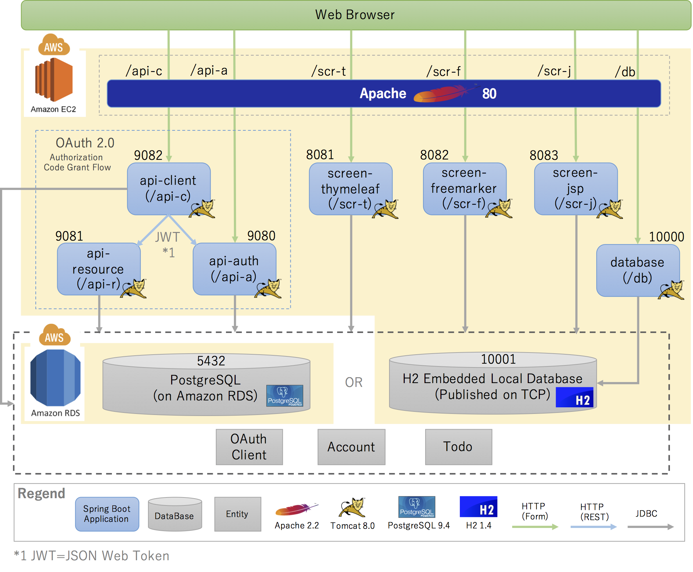

# spring-boot-multi-sample
Spring Boot Multi Project Samples

[](https://travis-ci.org/kazuki43zoo/spring-boot-multi-sample)

## Overview

Structure of this applications are following.



> Note: **Other modules and directories**
>
> * `component`, `component-web`, `domain` and `screen` modules are not Spring Boot Application. These modules provided common components to the Spring Boot Applications.
> * `service-conf` directory provide a conf file for OS Service such as the `init.d`.
> * `www` directory provide web content files for a Web Server such as the Apache.

## Getting Started

### Get project

If you are git user, clone this project using `git clone` command.

```bash
$ git clone https://github.com/kazuki43zoo/spring-boot-multi-sample.git
```

If you are not git user, download zip file form [here](https://github.com/kazuki43zoo/spring-boot-multi-sample/archive/master.zip) and expand to any directory.

### Build project

Build project using maven(`./mvnw`) command.

```bash
$ cd spring-boot-multi-sample
$ ./mvnw install
```

### Run applications

Run applications as background process using `java -jar` command.
(or run application as foreground process on different console without `&`)

```console
$ java -jar database/target/database-1.0.0-SNAPSHOT.jar &
$ java -jar api-auth/target/api-auth-1.0.0-SNAPSHOT.jar &
$ java -jar api-resource/target/api-resource-1.0.0-SNAPSHOT.jar &
$ java -jar api-client/target/api-client-1.0.0-SNAPSHOT.jar &
$ java -jar screen-thymeleaf/target/screen-thymeleaf-1.0.0-SNAPSHOT.jar &
$ java -jar screen-freemarker/target/screen-freemarker-1.0.0-SNAPSHOT.jar &
$ java -jar screen-jsp/target/screen-jsp-1.0.0-SNAPSHOT.war &
```

or run application as background process using `spring-boot:run` of `spring-boot-maven-plugin`.

```console
$ ./mvnw -f database/pom.xml spring-boot:run &
$ ./mvnw -f api-auth/pom.xml spring-boot:run &
$ ./mvnw -f api-resource/pom.xml spring-boot:run &
$ ./mvnw -f api-client/pom.xml spring-boot:run &
$ ./mvnw -f screen-thymeleaf/pom.xml spring-boot:run &
$ ./mvnw -f screen-freemarker/pom.xml spring-boot:run &
$ ./mvnw -f screen-jsp/pom.xml spring-boot:run &
```

### Access to applications

URLs refer to [Modules & Context Paths](#modules--context-paths).

If you need login, you can use embedded user as follows.

| Username | Password | ROLE |
| -------- | -------- | ---- |
| demo | demo | USER |
| admin | password | ADMIN<br>USER |
| user | password | USER |
| kazuki43zoo | password | USER |


### Stop applications

Move to current job using `fg` command and stop job using "Control + C" for all application.

```console
$ fg
./mvnw -f screen-jsp/pom.xml spring-boot:run
(Type "Control + C")
```

## Modules & Context Paths

| Type | Module | Context Path | Description | Remarks |
| :--: | :----- | ------------ | ----------- | ------- |
| API Server<br>(OAuth 2.0)  | api-auth          | /api-a | OAuth 2.0 Authorization Server (Resource Owner Authentication & Grant access authorities to resource)<br>[http://localhost:9080/api-a](http://localhost:9080/api-a) | |
|                            | api-resource      | /api-r | OAuth 2.0 Resource Server (RESTful Web Services)<br>[http://localhost:9081/api-r](http://localhost:9081/api-r) | |
|                            | api-client        | /api-c | OAuth 2.0 Client Application (Screen Application)<br>[http://localhost:9082/api-c](http://localhost:9082/api-c) | |
| Screen AP Server           | screen-thymeleaf  | /scr-t | Screen Application using Thymeleaf as view technology<br>[http://localhost:8081/scr-t](http://localhost:8081/scr-t) | |
|                            | screen-freemarker | /scr-f | Screen Application using FreeMarker as view technology<br>[http://localhost:8082/scr-f](http://localhost:8082/scr-f) | |
|                            | screen-jsp        | /scr-j | Screen Application using JSP as view technology<br>[http://localhost:8083/scr-j](http://localhost:8083/scr-j) | |
| H2 Database<br>Web Console | database          | /db    | Console Application of H2 Database<br>[http://localhost:10000/db](http://localhost:10000/db) | |
| Domain<br>Components       | domain            | -      | Domain components (`@Service`, `@Repository`, Domain Objects, etc ...) | |
| Common<br>Components       | component         | -      | Common components | |
|                            | component-web     | -      | Common components that depend on web layer (`@WebFilter`, `@WebListener`, etc ...) | |
|                            | screen            | -      | Application layer components(`@Controller`, `@ControllerAdvice`, Form, etc ...) for screen-xxx modules ... | |

## Application endpoints

### OAuth 2.0 Authorization Server

| Endpoint | Description | Remarks |
| -------- | ----------- | ------- |
| /oauth/authorize | Authorization Page(Grant access authorities to the specifying resource) | |
| /oauth/token | API for obtaining the access token(JWT) | |

### OAuth 2.0 Resource Server (RESTful Web Services)

| Endpoint | Description | Remarks |
| -------- | ----------- | ------- |
| / | API for returning hello message | |
| /todos | APIs for todo resources | |
| /todos/{todoId} | APIs for specifying todo resource | |

### Screen AP (or Auth 2.0 Client)

| Endpoint | Description | Remarks |
| -------- | ----------- | ------- |
| / | Top Page | |
| /todos | Todo List Page | |
| /todos/{todoId} | Todo Detail Page | |
| /login | Login Page | |
| /logout | Logout Processing | |

### H2 Database Web Console

| Endpoint | Description | Remarks |
| -------- | ----------- | ------- |
| / | Redirect to H2 Console Page | |
| /h2-console | H2 Console Page | |

# Appendix

## Run on EC2 instance of AWS

This sample application has been published using [EC2 instance of AWS ](http://ec2-52-69-78-174.ap-northeast-1.compute.amazonaws.com/).

### How to release to EC2 instance

It used the [release-aws.sh](https://github.com/kazuki43zoo/spring-boot-multi-sample/blob/master/release-aws.sh).

> Note: **Preconditions**
>
> * Installed the Git
> * Installed the OpenJDK 8
> * Installed the Apache

#### How to install the Git

```console
$ sudo yum -y install git
```

#### How to install the OpenJDK 8

```console
$ sudo yum -y install java-1.8.0-openjdk-devel
$ sudo alternatives --config java

There are 2 programs which provide 'java'.

  Selection    Command
-----------------------------------------------
*+ 1           /usr/lib/jvm/jre-1.7.0-openjdk.x86_64/bin/java
   2           /usr/lib/jvm/jre-1.8.0-openjdk.x86_64/bin/java

Enter to keep the current selection[+], or type selection number: 2
$ java -version
openjdk version "1.8.0_71"
OpenJDK Runtime Environment (build 1.8.0_71-b15)
OpenJDK 64-Bit Server VM (build 25.71-b15, mixed mode)
```

#### How to install the Apache

```console
$ sudo yum -y install httpd
$ sudo chkconfig httpd on
$ sudo service httpd start
```

#### How to manage a fully executable jar/war and configuration files

It managed in a `${HOME}/apps/${VERSION}` directory.

e.g.)

```console
$ ls -l ${HOME}/apps/1.0.0-SNAPSHOT
total 168768
-rw-rw-r-- 1 ec2-user ec2-user       19 Feb 27 17:03 api-auth.conf
-r-x------ 1 ec2-user ec2-user 31405282 Feb 27 17:03 api-auth.jar
-rw-rw-r-- 1 ec2-user ec2-user       19 Feb 27 17:03 api-client.conf
-r-x------ 1 ec2-user ec2-user 28951476 Feb 27 17:03 api-client.jar
-rw-rw-r-- 1 ec2-user ec2-user       19 Feb 27 17:03 api-resource.conf
-r-x------ 1 ec2-user ec2-user 23847338 Feb 27 17:03 api-resource.jar
-rw-rw-r-- 1 ec2-user ec2-user       19 Feb 27 17:03 database.conf
-r-x------ 1 ec2-user ec2-user 15647598 Feb 27 17:03 database.jar
-rw-rw-r-- 1 ec2-user ec2-user       19 Feb 27 17:03 screen-freemarker.conf
-r-x------ 1 ec2-user ec2-user 22004742 Feb 27 17:03 screen-freemarker.jar
-rw-rw-r-- 1 ec2-user ec2-user       19 Feb 27 17:03 screen-jsp.conf
-r-x------ 1 ec2-user ec2-user 23785134 Feb 27 17:03 screen-jsp.war
-rw-rw-r-- 1 ec2-user ec2-user       19 Feb 27 17:03 screen-thymeleaf.conf
-r-x------ 1 ec2-user ec2-user 27123851 Feb 27 17:03 screen-thymeleaf.jar
```

##### Set VM options into JAVA_OPTS

In this application, set the max memory at `*.conf`.

```bash
JAVA_OPTS=-Xmx128M
```

In this application, override the active profile for AWS at `api-client.conf`.

```bash
JAVA_OPTS="-Xmx128M -Dspring.profiles.active=aws"
```

#### How to register a service
 
It used the `init.d`.

```console
$ ls -l /etc/init.d/boot*
lrwxrwxrwx 1 root root 47 Feb 27 17:03 /etc/init.d/boot-api-a -> /home/ec2-user/apps/1.0.0-SNAPSHOT/api-auth.jar
lrwxrwxrwx 1 root root 49 Feb 27 17:03 /etc/init.d/boot-api-c -> /home/ec2-user/apps/1.0.0-SNAPSHOT/api-client.jar
lrwxrwxrwx 1 root root 51 Feb 27 17:03 /etc/init.d/boot-api-r -> /home/ec2-user/apps/1.0.0-SNAPSHOT/api-resource.jar
lrwxrwxrwx 1 root root 47 Feb 27 17:03 /etc/init.d/boot-db -> /home/ec2-user/apps/1.0.0-SNAPSHOT/database.jar
lrwxrwxrwx 1 root root 56 Feb 27 17:03 /etc/init.d/boot-scr-f -> /home/ec2-user/apps/1.0.0-SNAPSHOT/screen-freemarker.jar
lrwxrwxrwx 1 root root 49 Feb 27 17:03 /etc/init.d/boot-scr-j -> /home/ec2-user/apps/1.0.0-SNAPSHOT/screen-jsp.war
lrwxrwxrwx 1 root root 55 Feb 27 17:03 /etc/init.d/boot-scr-t -> /home/ec2-user/apps/1.0.0-SNAPSHOT/screen-thymeleaf.jar
```

Register a service using following command. A fully executable jar include [a startup script](#spring-boot-startup-script-in-fully-executable-jar).

```console
$ sudo ln -f -s ${HOME}/apps/${VERSION}/{artifact} /etc/init.d/{service-name}
```

e.g)

```console
$ sudo ln -f -s ${HOME}/apps/1.0.0-SNAPSHOT/database.jar /etc/init.d/boot-db
```

#### How to control a service by manually

It used the `service` command.

```console
$ sudo service {service-name} {option[start|stop|restart|force-reload|status|run]}
```

e.g)

```console
$ sudo service boot-db start
```


#### How to startup a service by automatically

It used the `chkconfig` command.

```console
$ sudo chkconfig --add {service-name}
```

e.g.)

```console
$ sudo chkconfig --add boot-db
```

## Apache Reverse Proxy Settings

This sample application use a Apache Reverse Proxy on EC2 instance of AWS.

Add settings for reverse proxy in `/etc/httpd/conf/httpd.conf`.

```conf
# ...

ProxyRequests Off

<Proxy *>
    Order deny,allow
    Allow from all
</Proxy>

ProxyPass /db http://localhost:10000/db
ProxyPassReverse /db http://localhost:10000/db

ProxyPass /api-a http://localhost:9080/api-a
ProxyPassReverse /api-a http://localhost:9080/api-a

ProxyPass /api-c http://localhost:9082/api-c
ProxyPassReverse /api-c http://localhost:9082/api-c

ProxyPass /scr-t http://localhost:8081/scr-t
ProxyPassReverse /scr-t http://localhost:8081/scr-t

ProxyPass /scr-f http://localhost:8082/scr-f
ProxyPassReverse /scr-f http://localhost:8082/scr-f

ProxyPass /scr-j http://localhost:8083/scr-j
ProxyPassReverse /scr-j http://localhost:8083/scr-j
```

> Note: **Preconditions**
>
> `mod_proxy` and `mod_proxy_http` should be loaded.
> 
> e.g.)
> ```conf
> LoadModule proxy_module modules/mod_proxy.so
> LoadModule proxy_http_module modules/mod_proxy_http.so
> ```

## Spring Boot Startup Script in Fully executable jar

A fully executable jar include a startup script file as follow.

```bash
#!/bin/bash
#
#    .   ____          _            __ _ _
#   /\\ / ___'_ __ _ _(_)_ __  __ _ \ \ \ \
#  ( ( )\___ | '_ | '_| | '_ \/ _` | \ \ \ \
#   \\/  ___)| |_)| | | | | || (_| |  ) ) ) )
#    '  |____| .__|_| |_|_| |_\__, | / / / /
#   =========|_|==============|___/=/_/_/_/
#   :: Spring Boot Startup Script ::
#

### BEGIN INIT INFO
# Provides:          database
# Required-Start:    $remote_fs $syslog $network
# Required-Stop:     $remote_fs $syslog $network
# Default-Start:     2 3 4 5
# Default-Stop:      0 1 6
# Short-Description: Spring Boot Multi Project Samples - Database -
# Description:       Spring IO Platform bill of materials
# chkconfig:         2345 99 01
### END INIT INFO

[[ -n "$DEBUG" ]] && set -x

# Initialize variables that cannot be provided by a .conf file
WORKING_DIR="$(pwd)"
# shellcheck disable=SC2153
[[ -n "$JARFILE" ]] && jarfile="$JARFILE"
[[ -n "$APP_NAME" ]] && identity="$APP_NAME"

# Follow symlinks to find the real jar and detect init.d script
cd "$(dirname "$0")" || exit 1
[[ -z "$jarfile" ]] && jarfile=$(pwd)/$(basename "$0")
while [[ -L "$jarfile" ]]; do
  [[ "$jarfile" =~ init\.d ]] && init_script=$(basename "$jarfile")
  jarfile=$(readlink "$jarfile")
  cd "$(dirname "$jarfile")" || exit 1
  jarfile=$(pwd)/$(basename "$jarfile")
done
jarfolder="$(dirname "$jarfile")"
cd "$WORKING_DIR" || exit 1

# Source any config file
configfile="$(basename "${jarfile%.*}.conf")"
# shellcheck source=/dev/null
[[ -r "${jarfolder}/${configfile}" ]] && source "${jarfolder}/${configfile}"

# Initialize PID/LOG locations if they weren't provided by the config file
[[ -z "$PID_FOLDER" ]] && PID_FOLDER="/var/run"
[[ -z "$LOG_FOLDER" ]] && LOG_FOLDER="/var/log"
! [[ -x "$PID_FOLDER" ]] && PID_FOLDER="/tmp"
! [[ -x "$LOG_FOLDER" ]] && LOG_FOLDER="/tmp"

# Set up defaults
[[ -z "$MODE" ]] && MODE="auto" # modes are "auto", "service" or "run"
[[ -z "$USE_START_STOP_DAEMON" ]] && USE_START_STOP_DAEMON="true"

# Create an identity for log/pid files
if [[ -z "$identity" ]]; then
  if [[ -n "$init_script" ]]; then
    identity="${init_script}"
  else
    identity=$(basename "${jarfile%.*}")_${jarfolder//\//}
  fi
fi

# Initialize log file name if not provided by the config file
[[ -z "$LOG_FILENAME" ]] && LOG_FILENAME="${identity}.log"


# ANSI Colors
echoRed() { echo $'\e[0;31m'"$1"$'\e[0m'; }
echoGreen() { echo $'\e[0;32m'"$1"$'\e[0m'; }
echoYellow() { echo $'\e[0;33m'"$1"$'\e[0m'; }

# Utility functions
checkPermissions() {
  touch "$pid_file" &> /dev/null || { echoRed "Operation not permitted (cannot access pid file)"; return 4; }
  touch "$log_file" &> /dev/null || { echoRed "Operation not permitted (cannot access log file)"; return 4; }
}

isRunning() {
  ps -p "$1" &> /dev/null
}

await_file() {
  end=$(date +%s)
  let "end+=10"
  while [[ ! -s "$1" ]]
  do
    now=$(date +%s)
    if [[ $now -ge $end ]]; then
      break
    fi
    sleep 1
  done
}

# Determine the script mode
action="run"
if [[ "$MODE" == "auto" && -n "$init_script" ]] || [[ "$MODE" == "service" ]]; then
  action="$1"
  shift
fi

# Build the pid and log filenames
if [[ "$identity" == "$init_script" ]] || [[ "$identity" == "$APP_NAME" ]]; then
  PID_FOLDER="$PID_FOLDER/${identity}"
fi
pid_file="$PID_FOLDER/${identity}.pid"
log_file="$LOG_FOLDER/$LOG_FILENAME"

# Determine the user to run as if we are root
# shellcheck disable=SC2012
[[ $(id -u) == "0" ]] && run_user=$(ls -ld "$jarfile" | awk '{print $3}')

# Find Java
if [[ -n "$JAVA_HOME" ]] && [[ -x "$JAVA_HOME/bin/java" ]]; then
    javaexe="$JAVA_HOME/bin/java"
elif type -p java > /dev/null 2>&1; then
    javaexe=$(type -p java)
elif [[ -x "/usr/bin/java" ]];  then
    javaexe="/usr/bin/java"
else
    echo "Unable to find Java"
    exit 1
fi

# Build actual command to execute
command="$javaexe -Dsun.misc.URLClassPath.disableJarChecking=true $JAVA_OPTS -jar $jarfile $RUN_ARGS $*"

# Action functions
start() {
  if [[ -f "$pid_file" ]]; then
    pid=$(cat "$pid_file")
    isRunning "$pid" && { echoYellow "Already running [$pid]"; return 0; }
  fi
  do_start "$@"
}

do_start() {
  working_dir=$(dirname "$jarfile")
  pushd "$working_dir" > /dev/null
  if [[ -n "$run_user" ]]; then
    mkdir "$PID_FOLDER" &> /dev/null
    checkPermissions || return $?
    chown "$run_user" "$PID_FOLDER"
    chown "$run_user" "$pid_file"
    chown "$run_user" "$log_file"
    if [ $USE_START_STOP_DAEMON = true ] && type start-stop-daemon > /dev/null 2>&1; then
      arguments=(-Dsun.misc.URLClassPath.disableJarChecking=true $JAVA_OPTS -jar $jarfile $RUN_ARGS "$@")
      start-stop-daemon --start --quiet \
        --chuid "$run_user" \
        --name "$identity" \
        --make-pidfile --pidfile "$pid_file" \
        --background --no-close \
        --startas "$javaexe" \
        --chdir "$working_dir" \
        -- "${arguments[@]}" \
        >> "$log_file" 2>&1
      await_file "$pid_file"
    else
      su -s /bin/sh -c "$command >> \"$log_file\" 2>&1 & echo \$!" "$run_user" > "$pid_file"
    fi
    pid=$(cat "$pid_file")
  else
    checkPermissions || return $?
    $command >> "$log_file" 2>&1 &
    pid=$!
    disown $pid
    echo "$pid" > "$pid_file"
  fi
  [[ -z $pid ]] && { echoRed "Failed to start"; return 1; }
  echoGreen "Started [$pid]"
}

stop() {
  [[ -f $pid_file ]] || { echoYellow "Not running (pidfile not found)"; return 0; }
  pid=$(cat "$pid_file")
  isRunning "$pid" || { echoYellow "Not running (process ${pid}). Removing stale pid file."; rm -f "$pid_file"; return 0; }
  do_stop "$pid" "$pid_file"
}

do_stop() {
  kill "$1" &> /dev/null || { echoRed "Unable to kill process $1"; return 1; }
  for i in $(seq 1 60); do
    isRunning "$1" || { echoGreen "Stopped [$1]"; rm -f "$2"; return 0; }
    [[ $i -eq 30 ]] && kill "$1" &> /dev/null
    sleep 1
  done
  echoRed "Unable to kill process $1";
  return 1;
}

restart() {
  stop && start
}

force_reload() {
  [[ -f $pid_file ]] || { echoRed "Not running (pidfile not found)"; return 7; }
  pid=$(cat "$pid_file")
  rm -f "$pid_file"
  isRunning "$pid" || { echoRed "Not running (process ${pid} not found)"; return 7; }
  do_stop "$pid" "$pid_file"
  do_start
}

status() {
  [[ -f "$pid_file" ]] || { echoRed "Not running"; return 3; }
  pid=$(cat "$pid_file")
  isRunning "$pid" || { echoRed "Not running (process ${pid} not found)"; return 1; }
  echoGreen "Running [$pid]"
  return 0
}

run() {
  pushd "$(dirname "$jarfile")" > /dev/null
  $command
  result=$?
  popd
  return "$result"
}

# Call the appropriate action function
case "$action" in
start)
  start "$@"; exit $?;;
stop)
  stop "$@"; exit $?;;
restart)
  restart "$@"; exit $?;;
force-reload)
  force_reload "$@"; exit $?;;
status)
  status "$@"; exit $?;;
run)
  run "$@"; exit $?;;
*)
  echo "Usage: $0 {start|stop|restart|force-reload|status|run}"; exit 1;
esac

exit 0
```
